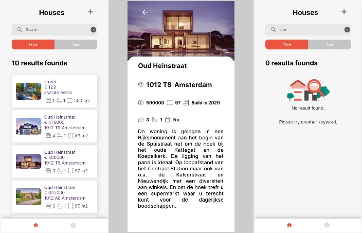

  <h1 align="center">Project House Listing</h1>

This is my 1st project using Vue, there are a lot of learnings and testing along the way.

Vue 3 - composition API
Store: Pinia
Router: vue-router

As my access to the API is only temporary, this project won't be deployed.

## Assignment

- Display a listing of houses
- Possibility to filter per city name,street, zip code, size, price
- Houses can be sorted by price or size
- User can create a house listing, and be able to update it or delete it

## Screenshots

   

